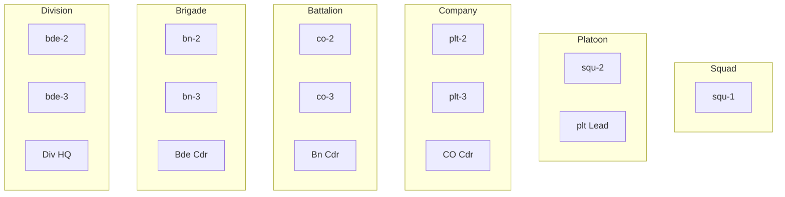
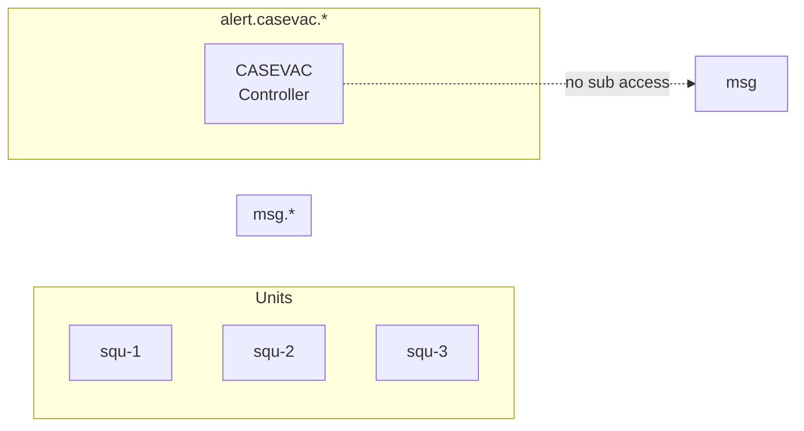
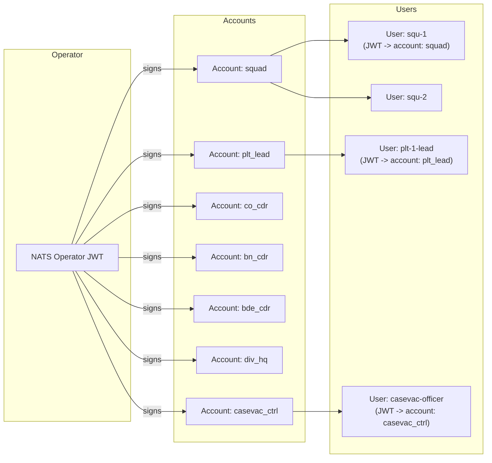

# NATS Subject & Auth Design for LOUHI

**Status:** Draft proposal  
**Date:** 2026-06-29

---

## 1. Design Goals

| Goal | Requirement |
|------|-------------|
| Need-to-know | A squad sees its own traffic; not its sister squad's |
| Upward visibility | Platoon lead sees all squads; company sees all platoons; etc. |
| Role-based override | CASEVAC controller sees CASEVAC messages globally, nothing else |
| Simple ACLs | Auth rules derive from the subject tree structure — no per-user exceptions |
| Audit-ready | Every publish has a clear, hierarchical subject |

---

## 2. Subject Tree

```
msg.<echelon_1>.<echelon_2>.<...>.<type>
```

### Tokens

- **Echelon fields** — mirror the org hierarchy: `div-N`, `bde-N`, `bn-N`, `co-N`, `plt-N`, `squ-N`, `team-N`
- **Type** — the message class, always the last token: `pos`, `sitrep`, `msg`, `contact`, `order`, `intel`, `cas`, `log`, `status`

### Example subjects

```
msg.div-1.bde-3.bn-2.co-1.plt-3.squ-1.pos
msg.div-1.bde-3.bn-2.co-1.plt-3.squ-1.sitrep
msg.div-1.bde-3.bn-2.co-1.plt-3.squ-1.msg
msg.div-1.bde-3.bn-2.co-1.plt-1.squ-2.contact
msg.div-2.bde-1.bn-4.co-2.plt-1.squ-1.intel
```

### Alert / cross-cutting domain

High-interest, role-specific traffic lives in a separate tree to keep `msg.*` ACLs simple.

```
alert.casevac.<echelon_path>.<casevac_id>
alert.emergency.<echelon_path>
alert.c2.<echelon_path>
```

---

## 3. Permission Model

The hierarchy IS the ACL. Each role gets a `pub` scope (what it can originate) and a `sub` scope (what it can read). Every scope is a wildcard — no denylist, no exceptions.

### 3.1 Regular unit roles



| Role | `pub` allow | `sub` allow |
|------|------------|-------------|
| **Squad** | `msg.div-N.bde-N.bn-N.co-N.plt-N.squ-N.>` | `msg.div-N.bde-N.bn-N.co-N.plt-N.squ-N.>` |
| **Platoon Lead** | `msg.div-N.bde-N.bn-N.co-N.plt-N.>` | `msg.div-N.bde-N.bn-N.co-N.plt-N.>` |
| **Company Cdr** | `msg.div-N.bde-N.bn-N.co-N.>` | `msg.div-N.bde-N.bn-N.co-N.>` |
| **Battalion Cdr** | `msg.div-N.bde-N.bn-N.>` | `msg.div-N.bde-N.bn-N.>` |
| **Brigade Cdr** | `msg.div-N.bde-N.>` | `msg.div-N.bde-N.>` |
| **Division HQ** | `msg.div-N.>` | `msg.div-N.>` |

Key property: each level can only publish **into its own subtree** — no spoofing higher or sibling units. Each level receives everything from **one level deeper**.

### 3.2 Cross-cutting roles



| Role | `pub` allow | `sub` allow | Notes |
|------|------------|-------------|-------|
| **CASEVAC Controller** | `alert.casevac.status.>` | `alert.casevac.>` | Sees all CASEVAC alerts; **no** `msg` subs — zero routine traffic |
| **Medic** | `msg.div-N.bde-N.bn-N.co-N.plt-N.>.cas` | `msg.div-N.bde-N.bn-N.co-N.plt-N.>.cas`, `alert.casevac.>` | Unit medic sees own unit's CASEVAC requests + all alert updates |
| **Intel Officer** | `msg.div-N.bde-N.bn-N.>.intel` | `msg.div-N.bde-N.bn-N.>.intel` | Publishes and reads intel at battalion level |
| **Logistics** | `msg.div-N.bde-N.>.log` | `msg.div-N.bde-N.>.log` | Supply-chain traffic at brigade level |

---

## 4. Implementation: NATS JWT Auth

### 4.1 Accounts (one per role archetype)

Rather than one JWT per human, define **accounts** that encode the permission set. Each user's JWT references their account via `sub` claim.



### 4.2 Account permissions example (squad account)

```json
{
  "sub": "ACC-squad-xxxxx",
  "pub": {
    "allow": ["msg.>"]
  },
  "sub": {
    "allow": ["msg.>"]
  },
  "interests": ["msg.>"]
}
```

The account merely declares capability. The **individual user JWT** then scopes it:

```json
{
  "sub": "USR-squ-1-xxxxx",
  "pub": {
    "allow": ["msg.div-1.bde-3.bn-2.co-1.plt-3.squ-1.>"]
  },
  "sub": {
    "allow": ["msg.div-1.bde-3.bn-2.co-1.plt-3.squ-1.>"]
  },
  "account": "ACC-squad-xxxxx"
}
```

This way account signing is a one-time setup; user signing stamps their `org_path` into the subject wildcards.

### 4.3 Unit ID allocation

A simple IDMS (or even a YAML file, early on) hands out the next unit identifier under its parent:

```yaml
org:
  div-1:
    bde-1: { bn-1: { co-1: { plt-1: { squ-1, squ-2 }, plt-2: { squ-1 } } } }
    bde-2: { bn-1: ... }
```

When `squ-2` is added under `plt-1`, its user JWT gets:

```
pub.sub allow: msg.div-1.bde-1.bn-1.co-1.plt-1.squ-2.>
```

No account change needed — the squad account already allows `msg.>` pub/sub; the user JWT restricts it.

---

## 5. JetStream Streams

Each message `type` maps to a stream or distinct subject prefix for retention:

| Type | Retention | Purpose |
|------|-----------|---------|
| `pos` | `WorkQueuePolicy` / last-per-subject | Current position, discard old |
| `sitrep` | `InterestPolicy` | Must be consumed by higher echelon |
| `msg` | `LimitsPolicy` (7d) | Persistent message log |
| `order` | `InterestPolicy` + ack | Guaranteed delivery |
| `contact` | `LimitsPolicy` (24h) | Spot reports |
| `intel` | `LimitsPolicy` (30d) | Intelligence, longer retention |
| `cas` | `InterestPolicy` + ack | CASEVAC requests — must be acknowledged |
| `log` | `LimitsPolicy` (90d) | Logistics / supply |

Stream names mirror the subject suffix: `msg_pos`, `msg_msg`, `alert_casevac`, etc. Consumers (per role/unit) use filtered subjects so they only drain their subtree.

---

## 6. Edge Cases

### 6.1 Cross-unit chatter (adjacent squads)

Not allowed by default — correct per need-to-know. If a mission requires it, a **tactical override** publishes on a separate short-lived subject:

```
tmp.mission-42.squ-1.squ-7
```

A temporary ACL update at the account level enables `sub` on `tmp.mission-42.>` for the involved user JWTs. After action, the subscription is revoked.

### 6.2 Medic forwarding a CASEVAC

Medic publishes `alert.casevac.div-1.bde-3.bn-2.co-1.plt-3.squ-1.<id>`. The CASEVAC controller (subscribed to `alert.casevac.>`) receives it instantly — no routing logic needed. The controller's acknowledgment publishes to `alert.casevac.status.<id>` which the medic (and parent unit) can see.

### 6.3 Higher echelon reaching down

A battalion commander publishes `msg.div-1.bde-3.bn-2.>` which includes `*.>` — their message lands on subjects under their whole subtree. Every unit in the battalion sees it. The commander does not need to know the exact `org_path` of the target — `co-1.plt-2.squ-3` is encoded in the message metadata, not the routing.

---

## 7. Summary

```
msg.<org_path>.<type>       ← routine traffic, ACLs by hierarchy depth
alert.<domain>.<org_path>   ← cross-cutting / role-specific traffic
```

- **Hierarchy = ACL.** No blacklists, no per-user exception lists.
- **Accounts = role archetypes.** One-time signing; user JWTs stamp the `org_path`.
- **Types = stream retention.** Tailor durability per message class.
- **Alert tree = override.** Dedicated subjects for role-specific visibility without exposing routine traffic.
