# NATS Message Flows

```mermaid
flowchart TB
    subgraph InProcess["In-process (msg.* subjects only)"]
        direction TB
        P_TAK["TAK Plugin
            pub: tak.>  sub: tak.>, location.position"]
        P_MAP["2D Map Plugin
            pub: location.request
            sub: location.position, location.position.reply"]
        P_OSG["3D Map (osgEarth)
            pub: location.request
            sub: msg.>, alert.>, tak.>,
                 location.position, location.position.reply"]
        P_LOC["Location Plugin (Comm type)
            pub: location.position, location.position.reply
            sub: location.request"]
        P_NATS["NATS Plugin (Comm type)
            pub: *   sub: (none declared)"]
        P_MSG["Message Viewer
            pub: (none)   sub: > (everything)"]
    end

    subgraph Routing["PluginManager - Routing"]
        PM["PluginManager.emitMessageToPlugins()"]
        BCAST["broadcastMessage()"]
        MATCH["matchesNatsTopic() - pattern vs topic"]
        SHOULD_PUB{"publishToBackend
            (per-plugin config)"}
        EMCON{"EMCON active?"}
    end

    subgraph Outbound["NATS Plugin - Server Connection"]
        NC["subscribeAllTopics()
            -> grp.>  -> sys.>"]
        PUB_GUARD{"topic starts with msg. ?"}
        NATS_PUB["natsConnection_Publish()"]
    end

    subgraph Server["NATS Server"]
        JWT["JWT Auth
            pub.allow / sub.allow"]
        ROUTE["Server routes by subject"]
        REMOTE["Remote LOUHI instances"]
    end

    %% Plugin -> PluginManager
    P_TAK -- "emit messageReceived(tak.s1, CoTXML)" --> PM
    P_LOC -- "emit messageReceived(location.position, json)" --> PM
    P_OSG -- "emit messageReceived(location.request, json)" --> PM

    %% PluginManager routing
    PM --> SHOULD_PUB
    SHOULD_PUB -- "true" --> EMCON
    SHOULD_PUB -- "false" --> BCAST
    EMCON -- "inactive" --> P_NATS
    EMCON -- "active" --> DROP["X dropped"]
    P_NATS --> PUB_GUARD
    PUB_GUARD -- "yes (msg.x) in-process only" --> DROP
    PUB_GUARD -- "no (grp.x, sys.x, ...)" --> NATS_PUB

    PM --> BCAST
    BCAST --> MATCH
    MATCH -- "subscriber matches topic" --> DELIVER["plugin->deliverMessage()"]
    MATCH -- "no match" --> SKIP["X skipped"]

    %% Outbound to server
    NATS_PUB --> JWT
    JWT -- "allowed" --> ROUTE
    JWT -- "denied" --> DROP2["X silently dropped"]
    ROUTE --> REMOTE

    %% Inbound from server
    REMOTE -- "grp.x / sys.x" --> JWT
    JWT -- "allowed" --> NC2["NatsClient::messageReceived()"]
    NC2 --> P_NATS
    P_NATS -- "emit messageReceived()" --> PM

    %% Example path: location.position
    P_LOC -. "location.position" .-> PM
    BCAST -.-> MATCH
    MATCH -.-> P_TAK
    MATCH -.-> P_OSG
    MATCH -.-> P_MAP
    MATCH -.-> P_MSG

    %% Example path: remote inbound
    REMOTE -. "grp.tacdata.pos" .-> NC2
    P_MSG -. "subscribes to >" .-> MATCH

    style DROP fill:#f99,stroke:#900
    style DROP2 fill:#f99,stroke:#900
    style SKIP fill:#f99,stroke:#900
    style PUB_GUARD fill:#ff9,stroke:#960
    style EMCON fill:#ff9,stroke:#960
    style JWT fill:#9cf,stroke:#069
```

## Flow Summary

| Direction | Subjects | Path | Filtering |
|-----------|----------|------|-----------|
| Plugin -> Plugin (in-process) | `msg.x`, `tak.x`, `location.*`, `alert.x` | `messageReceived` -> `emitMessageToPlugins` -> `broadcastMessage` | `publishToBackend` gating, EMCON, `matchesNatsTopic` |
| Plugin -> Server | `grp.*`, `sys.*`, anything not `msg.*` | -> Communication plugins -> `NatsPlugin::publish()` -> NATS server | `msg.*` blocked by guard, JWT enforces server-side |
| Server -> Plugin | `grp.*`, `sys.*` | NATS server -> NatsClient -> NatsPlugin -> `emitMessageToPlugins` -> `broadcastMessage` | JWT on server side, `matchesNatsTopic` for local delivery |
