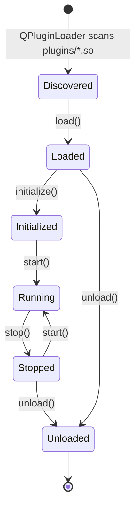
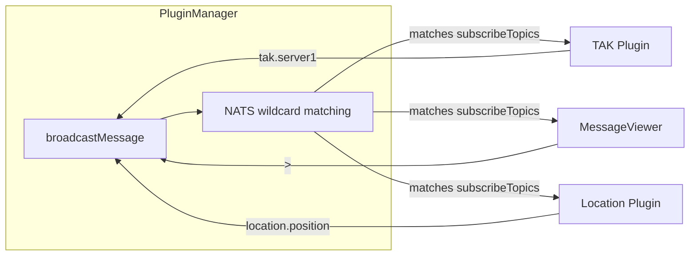
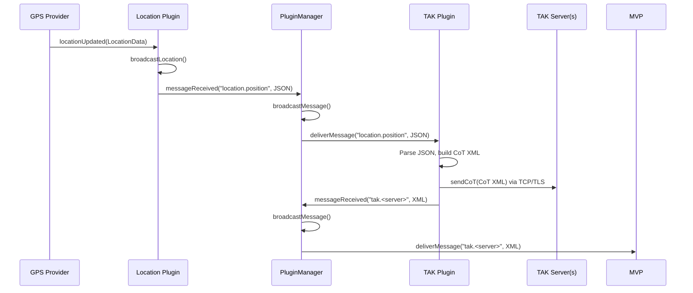
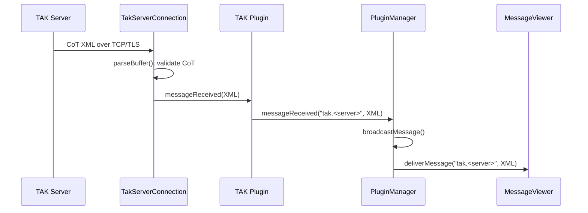
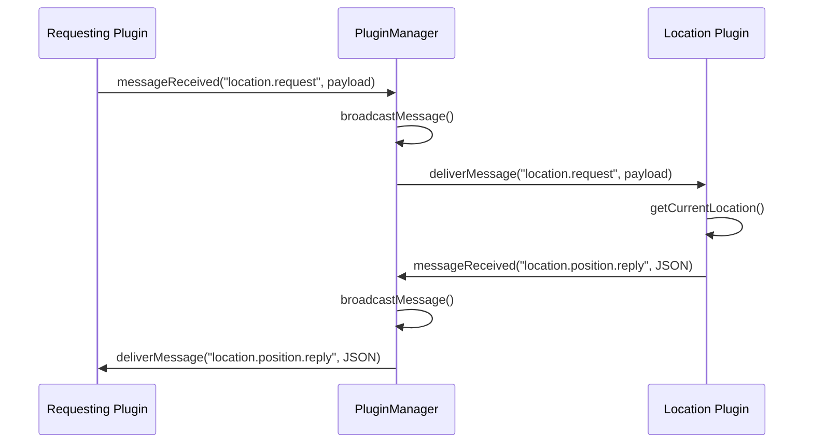

# LOUHI - Project Overview

## Architecture

LOUHI is a Qt5-based, plugin-driven Battle Management System. The application follows a **core + plugins** architecture where the main executable loads plugins at runtime as shared libraries via Qt's `QPluginLoader`.

### Three-Tier Build Structure

| Component | Output | Purpose |
|-----------|--------|---------|
| **Core Library** | `libplugininterface.so` | Shared interface: `PluginInterface`, `PluginManager`, `ConfigManager` |
| **Main Executable** | `louhi` | Entry point, MainWindow (dock-only layout), PluginManagerDialog, LED status widgets |
| **Plugins** | `plugins/*.so` | Runtime-loaded shared libraries implementing capabilities |

### Component Diagram

```mermaid
graph TB
    subgraph "Main Executable (louhi)"
        Main[main.cpp]
        MW[MainWindow]
        PMD[PluginManagerDialog]
        CLM[ConnectionLedManager]
        CSL[ConnectionStatusLED]
    end

    subgraph "Core Library (libplugininterface.so)"
        PI[PluginInterface]
        PM[PluginManager]
        CM[ConfigManager]
    end

    subgraph "Plugins (plugins/*.so)"
        NP[NATS Plugin]
        TP[TAK Plugin]
        LP[Location Plugin]
        MVP[MessageViewer Plugin]
    end

    subgraph "External"
        NATS[NATS Server]
        TAKS[TAK Server(s)]
        GPS[GPS / GPSD / Manual]
    end

    Main --> MW
    MW --> PM
    MW --> CM
    MW --> PMD
    MW --> CLM
    CLM --> CSL

    PM --> PI
    PM --> NP
    PM --> TP
    PM --> LP
    PM --> MVP

    NP <--> NATS
    TP <--> TAKS
    LP --> GPS
    TP -. "location.position" .-> LP
    TP -. "tak.<server>" .-> MVP
    LP -. "location.position" .-> TP
```

## Plugin System

### Plugin Types

| Type | Purpose | UI Behavior |
|------|---------|-------------|
| **Communication** | External comms (NATS, TAK, GPS) | No dock widget; Settings menu only |
| **Map** | Renders data on a map | May share or request dedicated view |
| **Screen** | Displays data in panels | Automatic dock widget + View menu |

### Lifecycle



### Message Routing



## Plugins

### NATS Communication Plugin

| Field | Value |
|-------|-------|
| ID | `nats_communication` |
| Type | Communication |
| Subscribe | *(dynamic, aggregated by PluginManager)* |
| Publish | `*` (any topic) |

Primary message bus transport. Wraps `libnats` and subscribes to topics requested by other plugins. The PluginManager aggregates all `subscribeTopics` from non-Communication plugins and pushes them to NATS via `setSubscribedTopics()`.

### TAK Communication Plugin

| Field | Value |
|-------|-------|
| ID | `tak_communication` |
| Type | Communication |
| Subscribe | `tak.>`, `location.position` |
| Publish | `tak.>` |

Connects to one or more Team Awareness Kit servers via TCP/TLS using CoT XML. Converts incoming CoT to NATS messages and converts `location.position` to CoT position reports sent to all connected servers.

### Location Plugin

| Field | Value |
|-------|-------|
| ID | `location_communication` |
| Type | Communication |
| Subscribe | `location.request` |
| Publish | `location.position`, `location.position.reply` |

Provides location from Serial GPS (NMEA), GPSD, or Manual entry with automatic main/fallback failover. Broadcasts location as JSON on change or at a configurable interval.

### MessageViewer Plugin

| Field | Value |
|-------|-------|
| ID | `message_viewer` |
| Type | Screen |
| Subscribe | `>` (all topics) |
| Publish | *(none)* |

Debug/monitoring tool displaying all messages flowing through the plugin bus. Gets an automatic dock widget.

## Message Flows

### Topic Registry

| Topic Pattern | Publisher(s) | Subscriber(s) | Payload | Purpose |
|---------------|-------------|---------------|---------|---------|
| `location.position` | Location | TAK, MessageViewer | JSON | Broadcast current GPS location |
| `location.position.reply` | Location | Any requester | JSON | Reply to location request |
| `location.request` | Any plugin | Location | Any | Request current location |
| `tak.<serverName>` | TAK | MessageViewer | XML (CoT) | CoT data from a specific TAK server |
| `tak.>` | TAK | MessageViewer | XML (CoT) | All TAK-related messages |
| `>` | All plugins | MessageViewer | Any | ALL messages (debug) |

### Flow: Location to TAK Server



### Flow: TAK Server to Other Plugins



### Flow: Location Request-Reply



### Complete System Message Flow

```mermaid
graph TB
    subgraph "External World"
        GPS_HW[Serial GPS / GPSD / Manual]
        NATS_SRV[NATS Server]
        TAK_SRV[TAK Server(s)]
    end

    subgraph "LOUHI Plugins"
        LP[Location Plugin]
        NP[NATS Plugin]
        TP[TAK Plugin]
        MVP[MessageViewer]
    end

    GPS_HW -->|NMEA / JSON / static| LP
    LP -->|"location.position"| NP
    LP -->|"location.position"| TP
    NP <--> NATS_SRV
    TP -->|"tak.<server>"| NP
    TP <-->|CoT XML / TCP-TLS| TAK_SRV
    NP -->|"location.position"| TP
    NP -->|"tak.<server>"| MVP
    NP -->|"location.position"| MVP

    subgraph "PluginManager Message Bus"
        NP -. "all subscribed topics" .-> TP
        NP -. "all subscribed topics" .-> LP
        NP -. "all subscribed topics" .-> MVP
        TP -. "tak.<server>" .-> MVP
        LP -. "location.position" .-> TP
    end
```

## Configuration

### Config File Location

`~/.config/Louhi/config.json`

### Structure

```json
{
  "app": {
    "window": { "width": 1024, "height": 768, "x": 0, "y": 0 }
  },
  "plugins": {
    "nats_communication": { "serverUrl": "localhost", "port": 4222, "autoConnect": false },
    "tak_communication": { "servers": [ { "id": "...", "name": "...", "address": "...", "port": 8089, "callsign": "...", "color": "...", "role": "...", "cotType": "a-f-G-U", "autoConnect": false, "debugLogging": false } ] },
    "location_communication": { "mainProvider": { "type": "manual", "providerConfig": { "latitude": 60.1699, "longitude": 24.9384, "altitude": 10.0, "valid": true } }, "fallbackProvider": { "type": "none" }, "broadcastOnChange": true, "broadcastInterval": 1000, "publishTopic": "location.position", "requestTopic": "location.request" },
    "message_viewer": { "maxMessages": 100, "subscribeTopics": [">"] }
  }
}
```

### Auto-Save/Restore

- **Startup**: `ConfigManager.loadConfig()` → `PluginManager.loadAllPlugins()` calls `plugin->setConfig()` for each plugin
- **Exit**: `MainWindow` destructor iterates enabled plugins, calls `plugin->getConfig()`, saves via `ConfigManager.saveConfig()`

## UI Structure

### Layout

The application uses a **dock-only layout** — there is no central widget. All Screen-type plugins are created as `QDockWidget` instances that fill the entire window space. Docks can be freely nested, tabbed, resized, and rearranged by the user. Dock nesting is enabled via `setDockNestingEnabled(true)`.

### Menu Bar (dynamically built)

```
Communication
  NATS Communication > [Connect] [Disconnect]
  TAK Communication  > [Connect] [Disconnect]
  Location           > [Connect] [Disconnect]

View
  Message Viewer     > [Show Message Viewer] [Clear Messages]

Settings
  NATS Communication > [configure dialog]
  TAK Communication  > [configure dialog]
  Location           > [configure dialog]

Plugin Manager       > [enable/disable plugins dialog]
```

### Status Bar LEDs

| Plugin | LED ID | Type | Name Source |
|--------|--------|------|-------------|
| NATS | `nats_communication` | NATS | Configured server URL |
| TAK (per server) | `tak_communication_<name>` | TAK | Server name from config |
| Location | `location_communication` | Location | Main provider name |

LED states: **Red** (Disconnected) → **Green** (Connected) → **Bright Green** (Traffic, auto-reverts after 250ms)

## Version

Defined centrally in `CMakeLists.txt` as `project(Louhi VERSION 0.1.0)`, auto-generated into `build/version.h` and accessible anywhere via `#include "version.h"` using `LOUHI_VERSION_STRING`, `LOUHI_VERSION_MAJOR`, etc.
