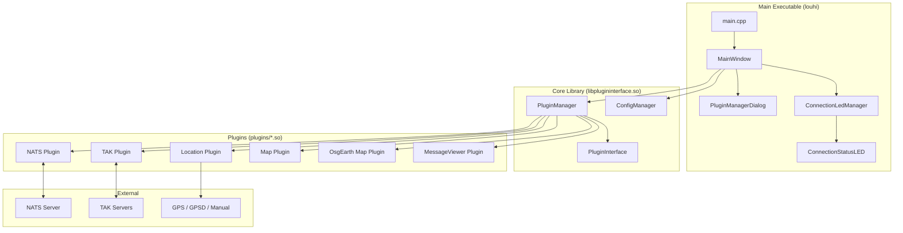
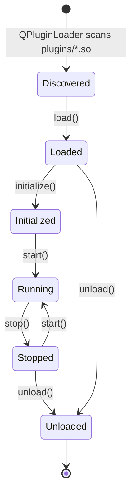
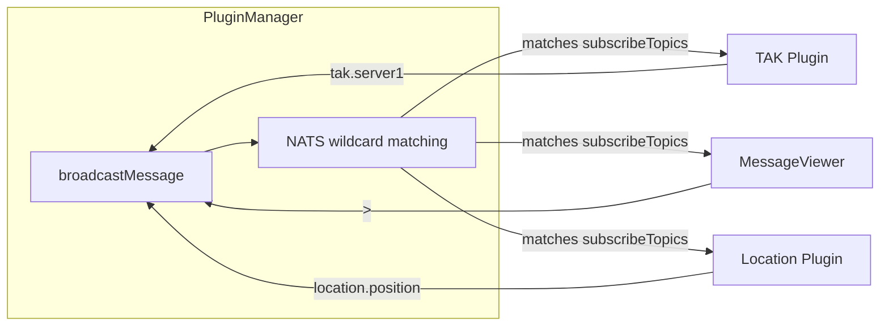
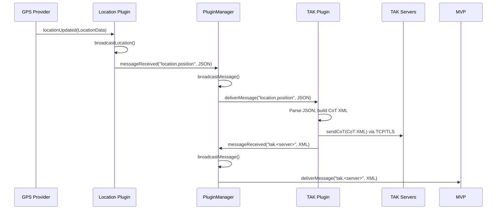
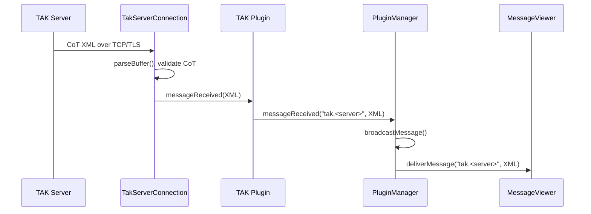
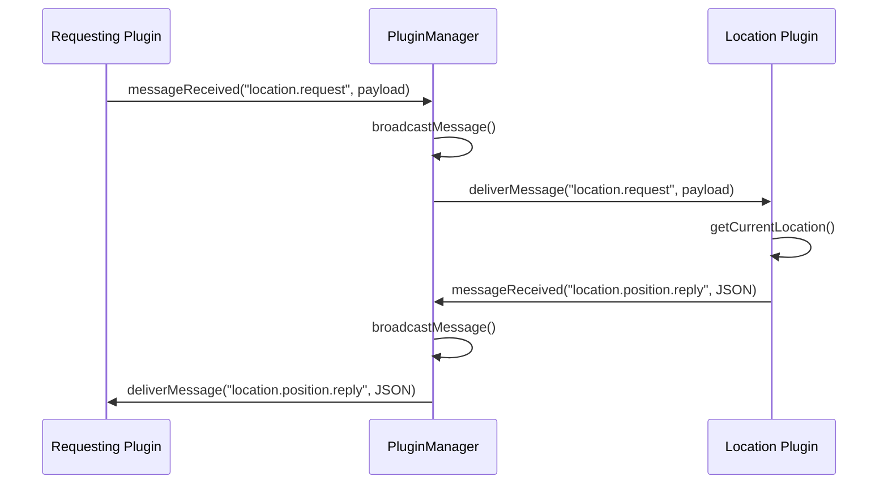
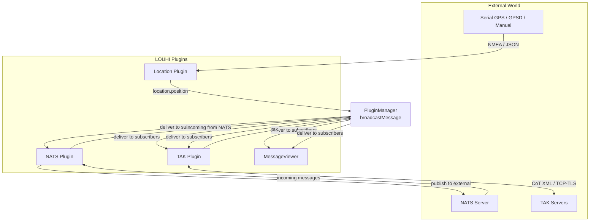

# LOUHI - Project Overview

## Architecture

LOUHI is a Qt5-based, plugin-driven Battle Management System. The application follows a **core + plugins** architecture where the main executable loads plugins at runtime as shared libraries via Qt's `QPluginLoader`.

### Three-Tier Build Structure

| Component | Output | Purpose |
|-----------|--------|---------|
| **Core Library** | `libplugininterface.so` | Shared interface: `PluginInterface`, `PluginManager`, `ConfigManager` |
| **Main Executable** | `louhi` | Entry point, MainWindow (dock-only layout), PluginManagerDialog, LED status widgets |
| **Plugins** | `plugins/*.so` | Runtime-loaded shared libraries implementing capabilities |

### Component Diagram



## Plugin System

### Plugin Types

| Type | Purpose | UI Behavior |
|------|---------|-------------|
| **Communication** | External comms (NATS, TAK, GPS) | No dock widget; Settings menu only |
| **Map** | Renders data on a map | May share or request dedicated view |
| **Screen** | Displays data in panels | Automatic dock widget + View menu |

### Lifecycle



### Message Routing



## Plugins

### NATS Communication Plugin

| Field | Value |
|-------|-------|
| ID | `nats_communication` |
| Type | Communication |
| Subscribe | *(dynamic, aggregated by PluginManager)* |
| Publish | `*` (any topic) |

Primary message bus transport. Wraps `libnats` and subscribes to topics requested by other plugins. The PluginManager aggregates all `subscribeTopics` from non-Communication plugins and pushes them to NATS via `setSubscribedTopics()`.

### TAK Communication Plugin

| Field | Value |
|-------|-------|
| ID | `tak_communication` |
| Type | Communication |
| Subscribe | `tak.>`, `location.position` |
| Publish | `tak.>` |

Connects to one or more Team Awareness Kit servers via TCP/TLS using CoT XML. Converts incoming CoT to NATS messages and converts `location.position` to CoT position reports sent to all connected servers.

### Location Plugin

| Field | Value |
|-------|-------|
| ID | `location_communication` |
| Type | Communication |
| Subscribe | `location.request` |
| Publish | `location.position`, `location.position.reply` |

Provides location from Serial GPS (NMEA), GPSD, or Manual entry with automatic main/fallback failover. Broadcasts location as JSON on change or at a configurable interval.

### MessageViewer Plugin

| Field | Value |
|-------|-------|
| ID | `message_viewer` |
| Type | Screen |
| Subscribe | `>` (all topics) |
| Publish | *(none)* |

Debug/monitoring tool displaying all messages flowing through the plugin bus. Gets an automatic dock widget.

### Map Plugin

| Field | Value |
|-------|-------|
| ID | `map_plugin` |
| Type | Map |
| Subscribe | `location.position`, `location.position.reply` |
| Publish | `location.request` |

2D tile map using QGraphicsView. Supports XYZ (OpenStreetMap, Carto) and WMS sources. Shares MapSource settings and tile cache with the OsgEarth plugin.

### OsgEarth Map Plugin

| Field | Value |
|-------|-------|
| ID | `osgearth_map` |
| Type | Map |
| Subscribe | *(none - future: location tracking)* |
| Publish | *(none)* |

3D globe map plugin using osgEarth 3.8 + OpenSceneGraph 3.7 (GL3 profile). Embedded via `QOpenGLWidget` + `osgViewer::GraphicsWindowEmbedded`. Mouse events forwarded to OSG event queue for native EarthManipulator handling. Shares MapSource config and tile cache with the 2D Map plugin.

## Message Flows

### Topic Registry

| Topic Pattern | Publisher(s) | Subscriber(s) | Payload | Purpose |
|---------------|-------------|---------------|---------|---------|
| `location.position` | Location | TAK, MessageViewer | JSON | Broadcast current GPS location |
| `location.position.reply` | Location | Any requester | JSON | Reply to location request |
| `location.request` | Any plugin | Location | Any | Request current location |
| `tak.<serverName>` | TAK | MessageViewer | XML (CoT) | CoT data from a specific TAK server |
| `tak.>` | TAK | MessageViewer | XML (CoT) | All TAK-related messages |
| `>` | All plugins | MessageViewer | Any | ALL messages (debug) |
| `location.request` | Map, OsgEarth | Location | Any | Request current position (used before auto-centering was removed from OsgEarth) |

### Flow: Location to TAK Server



### Flow: TAK Server to Other Plugins



### Flow: Location Request-Reply



### Complete System Message Flow



> **Note:** The PluginManager's `broadcastMessage()` skips the sender plugin
> via pointer comparison (`if (loaded.plugin == sender) continue;`).
> A plugin never receives its own published messages.

## Configuration

### Config File Location

`~/.config/Louhi/config.json`

### Structure

```json
{
  "app": {
    "window": { "width": 1024, "height": 768, "x": 0, "y": 0 },
    "dockState": "<base64-encoded QMainWindow::saveState()>",
    "language": "en"
  },
  "shared": {},
  "plugins": {
    "nats_communication": { "serverUrl": "localhost", "port": 4222, "autoConnect": false },
    "tak_communication": { "servers": [ { "id": "...", "name": "...", "address": "...", "port": 8089, "callsign": "...", "color": "...", "role": "...", "cotType": "a-f-G-U", "autoConnect": false, "debugLogging": false } ] },
    "location_communication": { "mainProvider": { "type": "manual", "providerConfig": { "latitude": 60.1699, "longitude": 24.9384, "altitude": 10.0, "valid": true } }, "fallbackProvider": { "type": "none" }, "broadcastOnChange": true, "broadcastInterval": 1000, "publishTopic": "location.position", "requestTopic": "location.request" },
    "message_viewer": { "maxMessages": 100, "subscribeTopics": [">"] },
    "map_plugin": { "latitude": 60.1699, "longitude": 24.9384, "zoom": 10, "sourceName": "OSM Standard", "customSources": [] },
    "osgearth_map": { "latitude": 60.1699, "longitude": 24.9384, "zoom": 14, "sourceName": "OSM Standard", "customSources": [] }
  }
}
```

### Auto-Save/Restore

#### On Startup

1. `ConfigManager.loadConfig()` reads `~/.config/Louhi/config.json`
2. `PluginManager.loadAllPlugins()` calls `plugin->setConfig()` for each plugin
3. `main.cpp` calls `MainWindow::restoreDockState()` after all docks are created

#### On Exit

1. `MainWindow` destructor saves window geometry (`x`, `y`, `width`, `height`)
2. Dock layout is serialized via `QMainWindow::saveState()`, base64-encoded, and stored as `app.dockState`
3. Each enabled plugin's config is saved via `plugin->getConfig()` under its plugin ID
4. `ConfigManager.saveConfig()` writes everything to disk

#### Dock State Persistence

- `QMainWindow::saveState()` captures positions, sizes, tabification, floating
  state, and visibility of all `QDockWidget` instances.
- Docks are identified by their `objectName`, set to the plugin's `info.name`.
- On startup, `restoreDockState()` applies the saved state after all plugin
  docks have been created. If no state is saved, a fallback resizes the map
  dock to 500 px width.

## UI Structure

### Layout

The application uses a **dock-only layout** — there is no central widget. All Screen-type plugins are created as `QDockWidget` instances that fill the entire window space. Docks can be freely nested, tabbed, resized, and rearranged by the user. Dock nesting is enabled via `setDockNestingEnabled(true)`.

### Menu Bar (dynamically built)

```
Communication
  NATS Communication > [Connect] [Disconnect]
  TAK Communication  > [Connect] [Disconnect]
  Location           > [Connect] [Disconnect]

View
  Message Viewer     > [Show Message Viewer] [Clear Messages]
  Map                > [Show Map]
  OsgEarth Map       > [Show 3D Map]

Settings
  NATS Communication > [configure dialog]
  TAK Communication  > [configure dialog]
  Location           > [configure dialog]

Plugin Manager       > [enable/disable plugins dialog]
```

### Status Bar LEDs

| Plugin | LED ID | Type | Name Source |
|--------|--------|------|-------------|
| NATS | `nats_communication` | NATS | Configured server URL |
| TAK (per server) | `tak_communication_<name>` | TAK | Server name from config |
| Location | `location_communication` | Location | Main provider name |

LED states: **Red** (Disconnected) → **Green** (Connected) → **Bright Green** (Traffic, auto-reverts after 250ms)

## Version

Defined centrally in `CMakeLists.txt` as `project(Louhi VERSION 0.1.0)`, auto-generated into `build/version.h` and accessible anywhere via `#include "version.h"` using `LOUHI_VERSION_STRING`, `LOUHI_VERSION_MAJOR`, etc.
